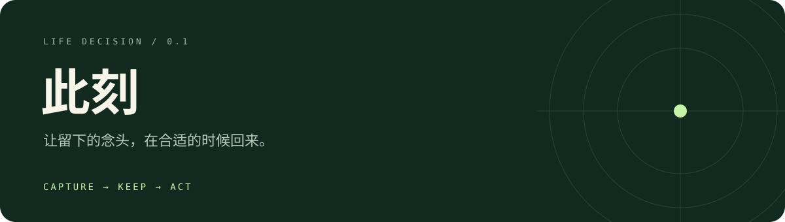

<p align="center"></p>

<p align="center">
  
  
  
</p>

**随手留下一件事，合适时给你一个行动。**

`Capture → Life → Context → Action → Feedback`

先保存，再理解。一次只推荐一个行动；不合适，就安静。

### Run

```sh
cp .env.example .env
pnpm install
pnpm build
pnpm db:migrate              # 先准备 PostgreSQL，并配置 .env
pnpm dev:api                # 另开终端运行 dev:worker、dev:demo
```

[Demo · localhost:5173](http://localhost:5173) · [API · localhost:3000/docs](http://localhost:3000/docs)

也可运行 `docker compose up --build`，Demo 位于 `localhost:4173`。

### Inside

**NestJS + Fastify** · **Zod** · **Drizzle** · **PostgreSQL Outbox**

文本输入、异步解析、可解释排序、反馈事件；默认本地模拟登录与 Mock 模型。原生微信端、图片／语音和云服务接入待完成。

[开发与验证](docs/development.md) · [审查记录](docs/code-review.md) · [首轮边界](docs/first-iteration.md)
